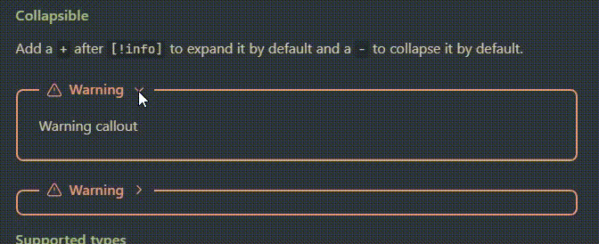

# Thin border Obsidian callouts

[thin-border-callout.css](thin-border-callout.css) is a [CSS snippet for Obsidian](https://help.obsidian.md/Extending+Obsidian/CSS+snippets) that modifies the appearance of [callouts](https://help.obsidian.md/Editing+and+formatting/Callouts).

This design is heavily inspired by ["Journaling in Obsidian - My Daily, Weekly, Monthly and Yearly Review Templates" by Marco Serafini on YouTube](https://youtu.be/uqrGVjdIYpk&t=346).

## How to use

To use the CSS snippet, follow these steps:

1. In Obsidian, open **Settings**.
2. Under **Appearance → CSS snippets**, select **Open snippets folder** (folder icon).
3. In the snippets folder, copy in [thin-border-callout.css](thin-border-callout.css).
4. In Obsidian, under **Appearance → CSS snippets**, select **Reload snippets** (refresh icon) to see the snippet in the list.
5. Enable the toggle to the right of **thin-border-callout**.
